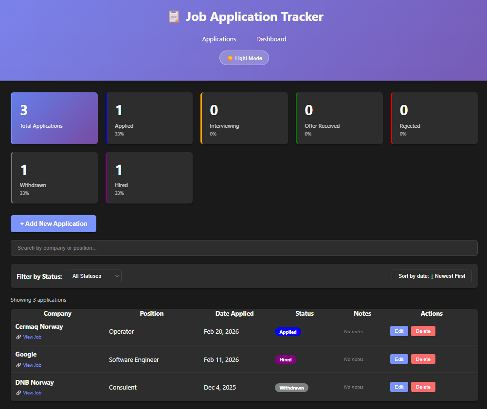
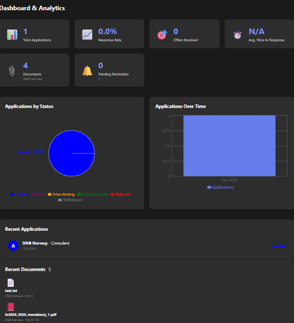

# Job Application Tracker

A full-stack web application to manage and track job applications throughout the hiring process, with an interactive analytics dashboard.

**Live Demo:** [job-application-tracker-ivory.vercel.app](https://job-application-tracker-ivory.vercel.app)

---

## Screenshots

### Applications List


### Dashboard


### Add Application Form


### Mobile View


> To add screenshots: take them from the live app and save them as `docs/screenshots/list-view.png`, `dashboard.png`, `create-form.png`, and `mobile-view.png`.

---

## Features

### Applications Page
- ✅ Create, read, update and delete job applications
- 🔍 Search by company name or position (partial, case-insensitive)
- 🗂️ Filter by status (All, Applied, Interviewing, Offer Received, etc.)
- ↕️ Sort by any column (ascending / descending)
- 📊 Stats summary bar showing total count and count per status

### Dashboard Page
- 🥧 Pie chart showing application distribution by status
- 📈 Bar chart showing applications submitted over time
- 🔢 Key metrics: total applications, active pipeline, success rate, interviews

### General
- 🌙 Dark mode toggle (persisted to `localStorage`)
- 🔔 Toast notifications for create / update / delete actions
- 📡 Offline detection banner when network is lost
- 🛡️ Error boundary fallback UI for unexpected crashes
- 📱 Fully responsive layout for mobile and desktop

---

## Tech Stack

### Backend
| | |
|---|---|
| **Language** | Kotlin 2.2 |
| **Framework** | Spring Boot 4.0 |
| **Database** | PostgreSQL |
| **ORM** | Spring Data JPA / Hibernate |
| **Validation** | Jakarta Bean Validation |
| **Build Tool** | Gradle |

### Frontend
| | |
|---|---|
| **Framework** | React 19 (Vite) |
| **Routing** | React Router DOM 7 |
| **HTTP Client** | Axios |
| **Charts** | Recharts |
| **Styling** | Plain CSS with CSS variables (light/dark theme) |

---

## Project Structure

```
JobApplicationTracker/
├── backend/
│   └── jobtracker/
│       ├── Dockerfile                        # Multi-stage Docker build for Render
│       └── src/main/kotlin/com/adrian/jobtracker/
│           ├── config/
│           │   └── WebConfig.kt              # CORS configuration
│           ├── controller/
│           │   └── ApplicationController.kt  # REST endpoints at /api/applications
│           ├── dto/
│           │   ├── ApplicationRequest.kt     # Validated input DTO
│           │   └── ApplicationResponse.kt    # Output DTO with fromEntity()
│           ├── entity/
│           │   ├── Application.kt            # JPA entity
│           │   └── ApplicationStatus.kt      # Enum (6 statuses)
│           ├── exception/
│           │   └── GlobalExceptionHandler.kt # 400/404/500 handling
│           ├── repository/
│           │   └── ApplicationRepository.kt  # JpaRepository + custom search queries
│           ├── service/
│           │   └── ApplicationService.kt     # Business logic
│           └── JobtrackerApplication.kt      # Entry point
├── frontend/
│   └── src/
│       ├── components/
│       │   ├── ApplicationForm.jsx           # Modal form for create/edit
│       │   ├── ApplicationList.jsx           # Table with sort, filter, search
│       │   ├── ErrorBoundary.jsx             # Catches React rendering errors
│       │   ├── NetworkStatus.jsx             # Offline detection banner
│       │   ├── StatsSummary.jsx              # Status count summary bar
│       │   └── ToastNotification.jsx         # Auto-dismissing toast alerts
│       ├── pages/
│       │   └── Dashboard.jsx                 # Analytics page with charts
│       ├── services/
│       │   └── frontApplicationService.js   # Axios API calls
│       ├── utils/
│       │   └── constants.js                  # Status labels and colors
│       ├── App.jsx                           # Root component, routing, global state
│       └── main.jsx                          # React entry point
└── docs/
    ├── API.md                                # Detailed API documentation
    └── screenshots/                          # App screenshots
```

---

## Prerequisites

- JDK 17+
- PostgreSQL
- Node.js 18+ and npm
- Gradle

---

## Local Setup

### Backend

1. **Clone the repository:**
   ```bash
   git clone https://github.com/Gamsty/JobApplicationTracker.git
   cd JobApplicationTracker/backend/jobtracker
   ```

2. **Create the PostgreSQL database:**
   ```sql
   CREATE DATABASE "jobTracker";
   ```

3. **Create `src/main/resources/application-local.properties`** (this file is git-ignored — never commit it):
   ```properties
   spring.datasource.username=your_postgres_username
   spring.datasource.password=your_postgres_password
   ```

4. **Run the backend:**
   ```bash
   ./gradlew bootRun
   ```

   The API will be available at `http://localhost:8080`.

### Frontend

1. **Install dependencies:**
   ```bash
   cd frontend
   npm install
   ```

2. **Start the dev server:**
   ```bash
   npm run dev
   ```

   The app will be available at `http://localhost:5173`.

> Both services must be running together. The frontend connects to the backend via `VITE_API_URL` (set in `frontend/.env.development`).

---

## API Documentation

See [docs/API.md](docs/API.md) for full endpoint reference with request/response examples.

**Quick reference:**

| Method | Endpoint | Description |
|--------|----------|-------------|
| GET | `/api/applications` | Get all applications |
| GET | `/api/applications?status=APPLIED` | Filter by status |
| GET | `/api/applications/{id}` | Get application by ID |
| POST | `/api/applications` | Create new application |
| PUT | `/api/applications/{id}` | Update application |
| DELETE | `/api/applications/{id}` | Delete application |
| GET | `/api/applications/search?company=google` | Search by company name |
| GET | `/api/applications/statistics` | Get statistics |

---

## Deployment

### Backend — Render.com (Docker)

1. Sign up at [render.com](https://render.com) and create a new **Web Service**
2. Connect your GitHub repository, set the root directory to `backend/jobtracker`
3. Select **Docker** as the environment (the `Dockerfile` handles the build)
4. Add these environment variables in the Render dashboard:

   | Variable | Value |
   |----------|-------|
   | `DATABASE_URL` | `jdbc:postgresql://<host>/<dbname>` |
   | `DATABASE_USERNAME` | Your DB username |
   | `DATABASE_PASSWORD` | Your DB password |
   | `DDL_AUTO` | `update` |
   | `SPRING_PROFILES_ACTIVE` | `prod` |

5. Note your service URL (e.g. `https://your-service.onrender.com`)

> **Free tier note:** Render spins down services after 15 minutes of inactivity. The first request after a period of inactivity may take ~30–60 seconds to wake up.

### Production Database — Render PostgreSQL

1. In Render, create a new **PostgreSQL** instance
2. From the database dashboard, copy the **Internal Database URL**
3. Split it into the three env vars above: `DATABASE_URL` (host + dbname only, prefixed with `jdbc:postgresql://`), `DATABASE_USERNAME`, and `DATABASE_PASSWORD`
4. Hibernate creates the schema automatically on first boot (`DDL_AUTO=update`)

### Frontend — Vercel

1. Sign up at [vercel.com](https://vercel.com) and create a new project
2. Import your GitHub repository and configure:
   - **Framework Preset:** Vite
   - **Root Directory:** `frontend`
   - **Build Command:** `npm run build`
   - **Output Directory:** `dist`
3. Add this environment variable in the Vercel dashboard:

   | Variable | Value |
   |----------|-------|
   | `VITE_API_URL` | `https://your-service.onrender.com/api/applications` |

4. Deploy — Vercel will give you a URL like `https://your-app.vercel.app`
5. Add that Vercel URL to the `allowedOrigins` list in `backend/jobtracker/src/main/kotlin/com/adrian/jobtracker/config/WebConfig.kt` and redeploy the backend

---

## License

This project is open source and available under the [MIT License](LICENSE).

## Author

**Adrian**
- GitHub: [@Gamsty](https://github.com/Gamsty)
