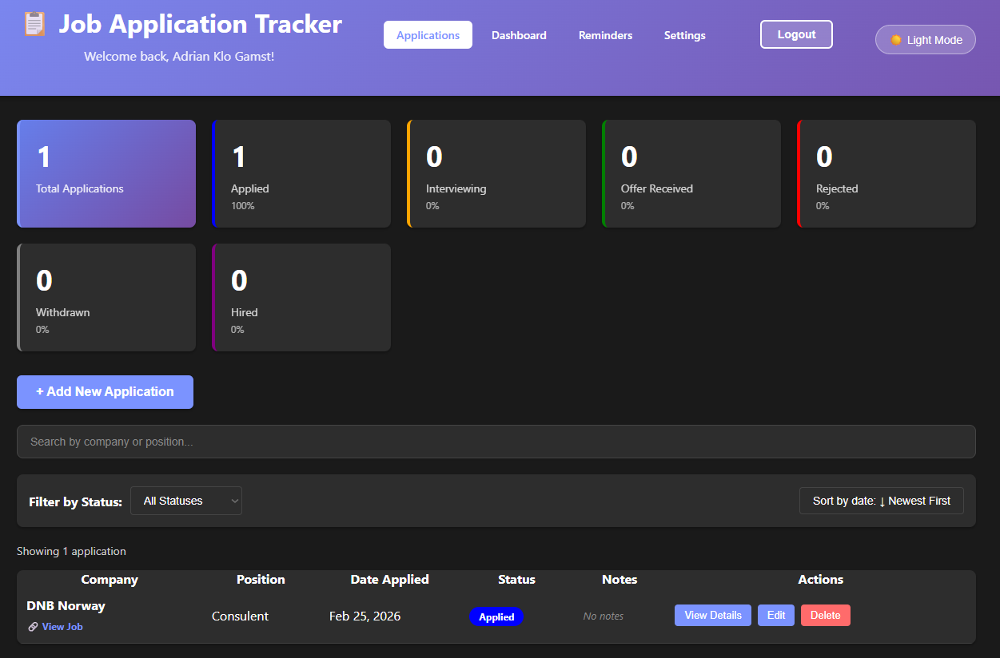
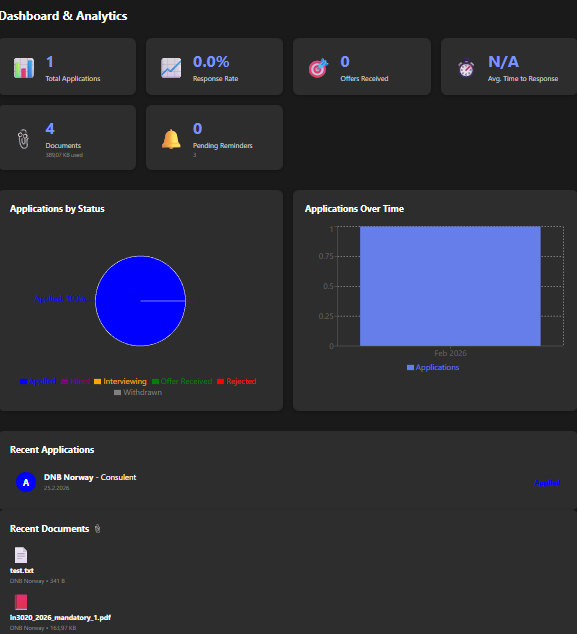
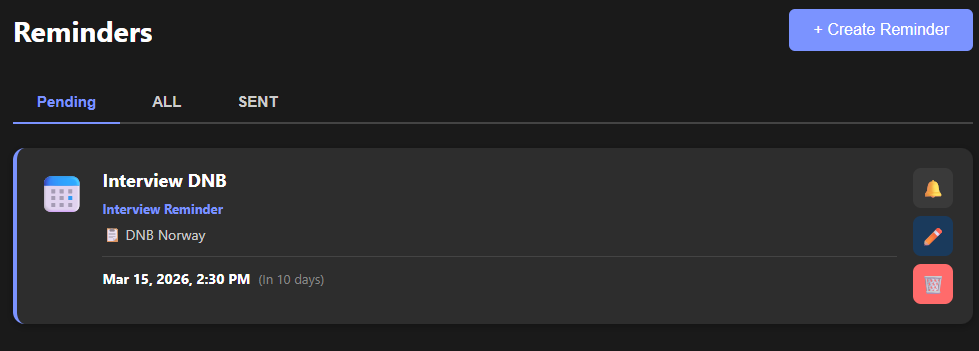
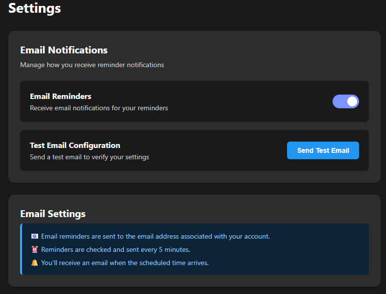

# Job Application Tracker

A full-stack web application to manage and track job applications throughout the hiring process. Features user authentication, interview tracking, document uploads, email reminders, and an interactive analytics dashboard.

**Live Demo:** [job-application-tracker-ivory.vercel.app](https://job-application-tracker-ivory.vercel.app)

---

## Screenshots

### Login


### Register


### Applications Details


### Dashboard


### Reminders


### Settings


---

## Features

### Authentication
- Register and login with email and password
- JWT-based stateless authentication
- BCrypt password hashing
- Automatic session restore from `localStorage`

### Applications Page
- Create, read, update and delete job applications
- Search by company name or position (partial, case-insensitive)
- Filter by status (All, Applied, Interviewing, Offer Received, etc.)
- Sort by any column (ascending / descending)
- Stats summary bar showing total count and count per status

### Interview Tracking
- Add multiple interview rounds per application
- Track round name, date/time, format (In Person, Video, Phone, Assessment)
- Record interviewer name/role, location, prep notes, feedback, and self-rating (1-5)
- Interview statuses: Scheduled, Completed, Cancelled, No Show
- Upcoming and past interview views

### Document Management
- Upload resumes, cover letters, portfolios, certificates, transcripts, references
- Files stored on the server filesystem with UUID-based naming
- Download documents with the original filename
- Track file type, size, and upload date
- Document summary with total storage usage and per-type breakdown

### Email Reminders
- Create reminders linked to applications and/or interviews
- Reminder types: Follow Up, Interview Upcoming, Application Deadline, Custom
- Schedule for any future date/time
- Enable/disable reminders without deleting them
- Automated email delivery via background scheduler (every 5 minutes)
- Test email button to verify SMTP configuration
- Gmail SMTP support via App Passwords

### Dashboard Page
- Pie chart showing application distribution by status
- Bar chart showing applications submitted over time
- Key metrics: total applications, response rate, offers received
- Upcoming interviews, recent documents, and pending reminders widgets
- Document storage summary

### Settings Page
- Email notification toggle
- Test email configuration
- Email settings info panel

### General
- Dark mode toggle (persisted to `localStorage`)
- Toast notifications for create / update / delete actions
- Offline detection banner when network is lost
- Error boundary fallback UI for unexpected crashes
- Fully responsive layout for mobile and desktop

---

## Tech Stack

### Backend
| | |
|---|---|
| **Language** | Kotlin 2.2 |
| **Framework** | Spring Boot 4.0 |
| **Database** | PostgreSQL |
| **ORM** | Spring Data JPA / Hibernate |
| **Security** | Spring Security + JWT (jjwt 0.12) |
| **Email** | Spring Boot Mail (Gmail SMTP) |
| **Scheduling** | Spring `@Scheduled` cron tasks |
| **Validation** | Jakarta Bean Validation |
| **Build Tool** | Gradle |

### Frontend
| | |
|---|---|
| **Framework** | React 19 (Vite 7) |
| **Routing** | React Router DOM 7 |
| **HTTP Client** | Axios |
| **Charts** | Recharts 3 |
| **Styling** | Plain CSS with CSS variables (light/dark theme) |

---

## Project Structure

```
JobApplicationTracker/
├── backend/jobtracker/
│   ├── Dockerfile
│   └── src/main/kotlin/com/adrian/jobtracker/
│       ├── config/
│       │   ├── SecurityConfig.kt          # JWT filter chain, CORS, BCrypt
│       │   └── WebConfig.kt               # CORS allowed origins
│       ├── controller/
│       │   ├── ApplicationController.kt   # /api/applications CRUD + search + stats
│       │   ├── AuthController.kt          # /api/auth login, register, me
│       │   ├── DocumentController.kt      # /api/documents upload, download, CRUD
│       │   ├── InterviewController.kt     # /api/interviews CRUD + upcoming/past
│       │   └── ReminderController.kt      # /api/reminders CRUD + toggle + test email
│       ├── dto/
│       │   ├── ApplicationRequest.kt      # Validated input DTO
│       │   ├── ApplicationResponse.kt     # Output DTO with fromEntity()
│       │   ├── AuthRequest.kt             # Login/Register/Auth response DTOs
│       │   ├── DocumentDto.kt             # Upload request, response, summary DTOs
│       │   ├── InterviewDto.kt            # Request, response, summary DTOs
│       │   └── ReminderDto.kt             # Request, response, summary DTOs
│       ├── entity/
│       │   ├── Application.kt             # JPA entity with status enum
│       │   ├── ApplicationStatus.kt       # APPLIED, INTERVIEWING, OFFER_RECEIVED...
│       │   ├── Document.kt                # File metadata + relations
│       │   ├── Interview.kt               # Round, format, status, feedback
│       │   ├── Reminder.kt                # Scheduled notification entity
│       │   └── User.kt                    # Auth entity with email notifications flag
│       ├── exception/
│       │   └── GlobalExceptionHandler.kt  # 400/401/403/404/409/413/500 handling
│       ├── repository/
│       │   ├── ApplicationRepository.kt
│       │   ├── DocumentRepository.kt
│       │   ├── InterviewRepository.kt
│       │   ├── ReminderRepository.kt
│       │   └── UserRepository.kt
│       ├── security/
│       │   ├── JwtAuthenticationFilter.kt # Validates JWT on every request
│       │   ├── JwtUtils.kt               # Generate, validate, parse JWT tokens
│       │   ├── UserDetailsImpl.kt         # Spring Security UserDetails wrapper
│       │   └── UserDetailsServiceImpl.kt  # Loads user by email for auth
│       └── service/
│           ├── ApplicationService.kt      # Application CRUD + statistics
│           ├── AuthService.kt             # Register, login, get current user
│           ├── DocumentService.kt         # Upload, download, delete, summary
│           ├── EmailService.kt            # HTML email builder + sender
│           ├── FileStorageService.kt      # Filesystem file operations
│           ├── InterviewService.kt        # Interview CRUD + upcoming/past
│           ├── ReminderSchedulerService.kt # @Scheduled cron task for email delivery
│           └── ReminderService.kt         # Reminder CRUD + toggle + summary
│
├── frontend/src/
│   ├── components/
│   │   ├── ApplicationDetails.jsx         # Detail modal with interviews + documents
│   │   ├── ApplicationForm.jsx            # Modal form for create/edit application
│   │   ├── ApplicationList.jsx            # Table with sort, filter, search
│   │   ├── DocumentList.jsx               # File list with upload, download, delete
│   │   ├── DocumentUploadForm.jsx         # File upload form with type selection
│   │   ├── ErrorBoundary.jsx              # Catches React rendering errors
│   │   ├── InterviewForm.jsx              # Modal form for create/edit interview
│   │   ├── Interviewlist.jsx              # Interview timeline with status badges
│   │   ├── NetworkStatus.jsx              # Offline detection banner
│   │   ├── ProtectedRoute.jsx             # Redirects to login if unauthenticated
│   │   ├── ReminderForm.jsx               # Modal form for create/edit reminder
│   │   ├── ReminderList.jsx               # Reminder list with toggle, filter, badges
│   │   ├── StatsSummary.jsx               # Status count summary bar
│   │   └── ToastNotification.jsx          # Auto-dismissing toast alerts
│   ├── context/
│   │   └── AuthContext.jsx                # JWT auth state + login/register/logout
│   ├── pages/
│   │   ├── Dashboard.jsx                  # Analytics with charts and widgets
│   │   ├── Login.jsx                      # Login form
│   │   ├── Register.jsx                   # Registration form
│   │   ├── Reminders.jsx                  # Reminder management page
│   │   └── Settings.jsx                   # Email notification preferences
│   ├── services/
│   │   ├── documentService.js             # Document API calls
│   │   ├── frontApplicationService.js     # Application API calls + axios interceptors
│   │   ├── interviewService.js            # Interview API calls
│   │   └── reminderService.js             # Reminder API calls
│   ├── utils/
│   │   └── constants.js                   # Status labels, colors, icons
│   ├── App.jsx                            # Root component, routing, global state
│   └── main.jsx                           # React entry point
│
└── docs/
    ├── API.md                             # Full API documentation
    └── screenshots/                       # App screenshots
```

---

## Prerequisites

- JDK 17+
- PostgreSQL
- Node.js 18+ and npm
- Gradle

---

## Local Setup

### Backend

1. **Clone the repository:**
   ```bash
   git clone https://github.com/Gamsty/JobApplicationTracker.git
   cd JobApplicationTracker/backend/jobtracker
   ```

2. **Create the PostgreSQL database:**
   ```sql
   CREATE DATABASE "jobTracker";
   ```

3. **Create `src/main/resources/application-local.yml`** with your credentials:
   ```yaml
   spring:
     datasource:
       username: your_postgres_username
       password: your_postgres_password
     mail:
       username: your_gmail@gmail.com
       password: your_gmail_app_password

   jwt:
     secret: your_256_bit_secret_key
   ```

   > For Gmail SMTP: enable 2FA on your Google account, then generate an App Password at Google Account > Security > App Passwords.

4. **Run the backend:**
   ```bash
   ./gradlew bootRun
   ```

   The API will be available at `http://localhost:8080`.

### Frontend

1. **Install dependencies:**
   ```bash
   cd frontend
   npm install
   ```

2. **Start the dev server:**
   ```bash
   npm run dev
   ```

   The app will be available at `http://localhost:5173`.

> Both services must be running together. The frontend connects to the backend via `VITE_API_URL` (set in `frontend/.env.development`).

---

## API Documentation

See [docs/API.md](docs/API.md) for the full endpoint reference with request/response examples.

**Quick reference:**

### Authentication (Public)
| Method | Endpoint | Description |
|--------|----------|-------------|
| POST | `/api/auth/register` | Create account, returns JWT |
| POST | `/api/auth/login` | Login, returns JWT |
| GET | `/api/auth/me` | Get current user info |

### Applications (Requires JWT)
| Method | Endpoint | Description |
|--------|----------|-------------|
| GET | `/api/applications` | Get all (optional `?status=`) |
| GET | `/api/applications/{id}` | Get by ID |
| POST | `/api/applications` | Create application |
| PUT | `/api/applications/{id}` | Update application |
| DELETE | `/api/applications/{id}` | Delete application |
| GET | `/api/applications/search?company=` | Search by company |
| GET | `/api/applications/statistics` | Get statistics |

### Interviews (Requires JWT)
| Method | Endpoint | Description |
|--------|----------|-------------|
| GET | `/api/interviews/application/{appId}` | Get by application |
| GET | `/api/interviews/{id}` | Get by ID |
| POST | `/api/interviews` | Create interview |
| PUT | `/api/interviews/{id}` | Update interview |
| DELETE | `/api/interviews/{id}` | Delete interview |
| GET | `/api/interviews/upcoming` | Get upcoming interviews |
| GET | `/api/interviews/past` | Get past interviews |
| GET | `/api/interviews/summary` | Get interview stats |

### Documents (Requires JWT)
| Method | Endpoint | Description |
|--------|----------|-------------|
| POST | `/api/documents` | Upload (multipart/form-data) |
| GET | `/api/documents/application/{appId}` | Get by application |
| GET | `/api/documents/{id}` | Get metadata |
| GET | `/api/documents/{id}/download` | Download file |
| PUT | `/api/documents/{id}` | Update description |
| DELETE | `/api/documents/{id}` | Delete document |
| GET | `/api/documents/my-documents` | Get all user documents |
| GET | `/api/documents/summary` | Get storage summary |

### Reminders (Requires JWT)
| Method | Endpoint | Description |
|--------|----------|-------------|
| POST | `/api/reminders` | Create reminder |
| GET | `/api/reminders` | Get all reminders |
| GET | `/api/reminders/pending` | Get pending reminders |
| GET | `/api/reminders/{id}` | Get by ID |
| PUT | `/api/reminders/{id}` | Update reminder |
| DELETE | `/api/reminders/{id}` | Delete reminder |
| PATCH | `/api/reminders/{id}/toggle` | Toggle enabled |
| GET | `/api/reminders/summary` | Get reminder stats |
| POST | `/api/reminders/test-email` | Send test email |

---

## Deployment

### Backend — Render.com (Docker)

1. Sign up at [render.com](https://render.com) and create a new **Web Service**
2. Connect your GitHub repository, set the root directory to `backend/jobtracker`
3. Select **Docker** as the environment (the `Dockerfile` handles the build)
4. Add these environment variables in the Render dashboard:

   | Variable | Value |
   |----------|-------|
   | `DATABASE_URL` | `jdbc:postgresql://<host>/<dbname>` |
   | `DATABASE_USERNAME` | Your DB username |
   | `DATABASE_PASSWORD` | Your DB password |
   | `DDL_AUTO` | `update` |
   | `SPRING_PROFILES_ACTIVE` | `prod` |
   | `JWT_SECRET` | A secure 256-bit secret key |
   | `MAIL_USERNAME` | Your Gmail address |
   | `MAIL_PASSWORD` | Your Gmail App Password |
   | `FRONTEND_URL` | Your Vercel frontend URL |

5. Note your service URL (e.g. `https://your-service.onrender.com`)

### Production Database — Render PostgreSQL

1. In Render, create a new **PostgreSQL** instance
2. From the database dashboard, copy the **Internal Database URL**
3. Split it into the three env vars above: `DATABASE_URL` (host + dbname only, prefixed with `jdbc:postgresql://`), `DATABASE_USERNAME`, and `DATABASE_PASSWORD`
4. Hibernate creates the schema automatically on first boot (`DDL_AUTO=update`)

### Frontend — Vercel

1. Sign up at [vercel.com](https://vercel.com) and create a new project
2. Import your GitHub repository and configure:
   - **Framework Preset:** Vite
   - **Root Directory:** `frontend`
   - **Build Command:** `npm run build`
   - **Output Directory:** `dist`
3. Add this environment variable in the Vercel dashboard:

   | Variable | Value |
   |----------|-------|
   | `VITE_API_URL` | `https://your-service.onrender.com` |

4. Deploy — Vercel will give you a URL like `https://your-app.vercel.app`
5. Add that Vercel URL to the `allowedOrigins` list in `backend/.../config/WebConfig.kt` and redeploy the backend

---

## License

This project is open source and available under the [MIT License](LICENSE).

## Author

**Adrian**
- GitHub: [@Gamsty](https://github.com/Gamsty)
